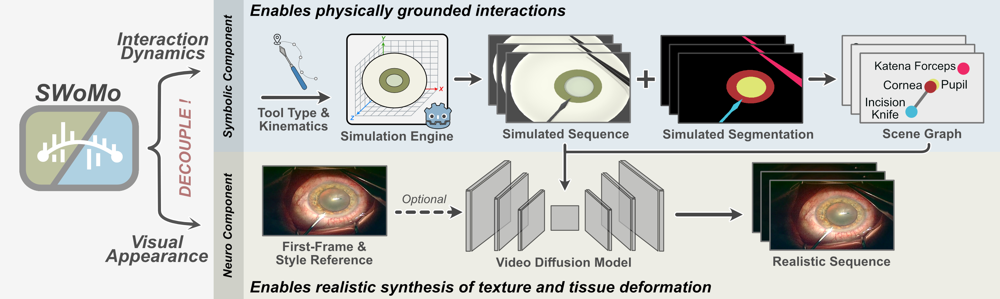

<div id="top" align="center">

# SWoMo: Neuro-Symbolic World Model for Cataract Surgery Simulation (MICCAI 2026 - Early Accept)
  Ssharvien Kumar Sivakumar, Akwele Johnson, Anirudh Dhingra, Yannik Frisch, Ghazal Ghazaei, Anirban Mukhopadhyay 

  [](https://arxiv.org/abs/2605.16530)
  [](https://ssharvienkumar.github.io/SWoMo/)
  [](https://huggingface.co/SsharvienKumar/SWoMo)
  [](https://github.com/MECLabTUDA/IntrekSAM)
</div>

***This framework provides ability to use any combination of text, graph, image and video as conditioning for video synthesisation. We have provided sample configs to run training and inference for all these combinations. Feel free to use our work for comparisons and to cite it!***

## 🔑 Key Features
- SWoMo is a neuro-symbolic world model for surgical simulation that decouples interaction dynamics from visual appearance. 
- Using an inverse pairing strategy, real surgical videos are reconstructed in a simulator to create paired data for training a video diffusion model for sim-to-real translation, with intermediate scene graphs serving as a constraint regularizer. 
- We demonstrate improved phase recognition, unsupervised style transfer, and strong generalisation to unseen interaction geometries.



## 🛠 Setup
```bash
git clone https://github.com/MECLabTUDA/SWoMo.git
cd SWoMo
conda env create -f environment.yaml
conda activate swomo
```


## 💾 Dataset Preparation and Annotation Tools
We released our interactive SAM2-based annotation tool in a separate repository: [IntrekSAM](https://github.com/MECLabTUDA/IntrekSAM). In our research, we found that there was no existing tool for video segmentation annotation that is free, open-source, locally deployable, easily modifiable, supports multi-class segmentation, and is simple to set up. Therefore, we rewrote the GUI in Python while still keeping the original SAM2 backend.

We also make our processed Cataract-1k data available on [Hugging Face](https://huggingface.co/SsharvienKumar/SWoMo/tree/main/datasets), including real videos, simulated videos, simulated segmentations, and scene graphs. If you would like to use our **manually annotated segmentations of the real videos (at 16 fps)** for the 1,068 videos from Cataract-1K and 50 videos from CATARACTS, please contact me via the email address in the paper. I would also be happy to share additional annotations described in the paper, such as phase labels and tracking point annotation, upon request.


## 🏁 Checkpoints
Download the checkpoints from [Huggingface](https://huggingface.co/SsharvienKumar/SWoMo/tree/main/checkpoints) and place them in [checkpoints](./checkpoints) folder. 


## 💥 Sampling with SWoMo
Conditioned with initial frame, graph, and video. For other conditioning combination, refer here: [./configs/inference](./configs/inference)
```bash
python sample.py --inference_config ./configs/inference/inference_img_graph_vid_cataracts.yaml
```

## ⏳ Training SWoMo
**Step 1:** Train Image VQGAN and Segmentation VQGAN (For Graph Encoders)
```bash
python swomo/taming/main.py --base configs/vae/config_image_autoencoder_vqgan_cataract.yaml -t --gpus 0, --logdir ./checkpoints/Cataract-1K

python swomo/taming/main.py --base configs/vae/config_segmentation_autoencoder_vqgan_cataract.yaml -t --gpus 0, --logdir ./checkpoints/Cataract-1K
```

**Step 2:** Train Another VAE (For Video Diffusion Model)
```bash
python swomo/ldm/main.py --base configs/vae/config_autoencoderkl_cataract.yaml -t --gpus 0, --logdir ./checkpoints/Cataract-1K

# Converting a CompVis VAE to Diffusers VAE Format
# IMPORTANT: First update Diffusers to version 0.31.0, run the script, and then downgrade back to 0.21.2
python scripts/ae_compvis_to_diffuser.py \
    --vae_pt_path /path/to/checkpoints/last.ckpt \
    --dump_path /path/to/save/vae_vid_diffusion
```

**Step 3:** Train Both Graph Encoders
```bash
python train_graph.py --name masked --config configs/graph/graph_cataract.yaml
python train_graph.py --name segclip --config configs/graph/graph_cataract.yaml
```

**Step 4:** Train Video Diffusion Model (Without Video Conditioning)

Single-GPU Setup
```bash
python train.py --config configs/training/training_img_graph_xvid_cataracts -n swomo_training
```

Multi-GPU Setup (Single Node)
```bash
python -m torch.distributed.run \
    --nproc_per_node=${GPU_PER_NODE} \
    --master_addr=127.0.0.1 \
    --master_port=29501 \
    --nnodes=1 \
    --node_rank=0 \
    train.py \
    --config configs/training/training_img_graph_xvid_cataracts.yaml \
    -n swomo_training
```

**Step 5:** Train ControlNet (For Video Conditioning)

Update the `finetuned_unet_path` in the config with the model trained in Step 4. The training of ControlNet can also be run in a multi-GPU setup, similar to Step 4.

```bash
python train.py --config configs/training/training_img_graph_vid_cataracts -n swomo_training
```


## 📜 Citations
If you are using SWoMo for your paper, please cite the following paper:
```
@article{sivakumar2026swomo,
  title={SWoMo: Neuro-Symbolic World Model for Cataract Surgery Simulation},
  author={Sivakumar, Ssharvien Kumar and Johnson, Akwele and Dhingra, Anirudh and Frisch, Yannik and Ghazaei, Ghazal and Mukhopadhyay, Anirban},
  journal={arXiv preprint arXiv:2605.16530},
  year={2026}
}
```


## ⭐ Acknowledgement
Thanks for the following projects and theoretical works that we have either used or inspired from:
- [SG2VID](https://github.com/MECLabTUDA/SG2VID)
- [VQGAN](https://github.com/CompVis/taming-transformers)

